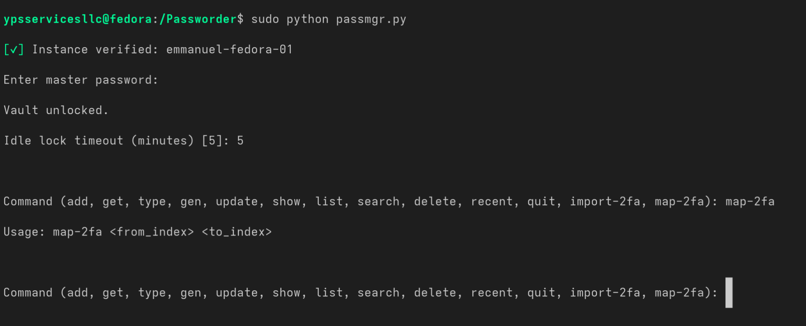
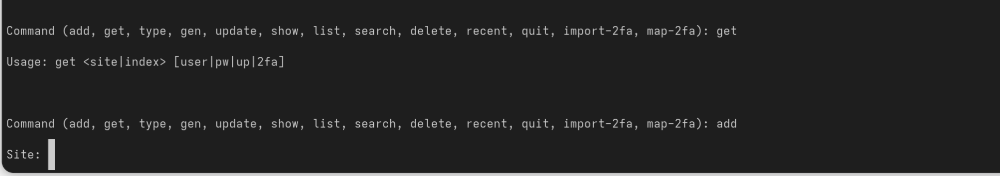
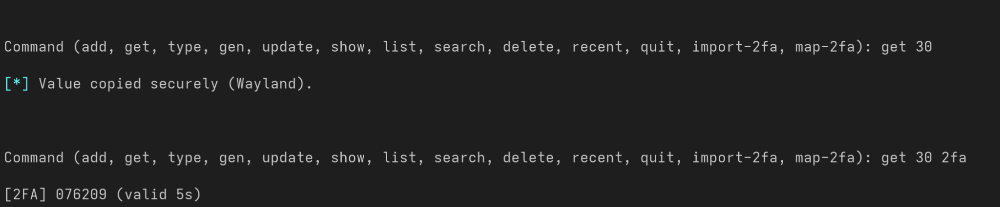
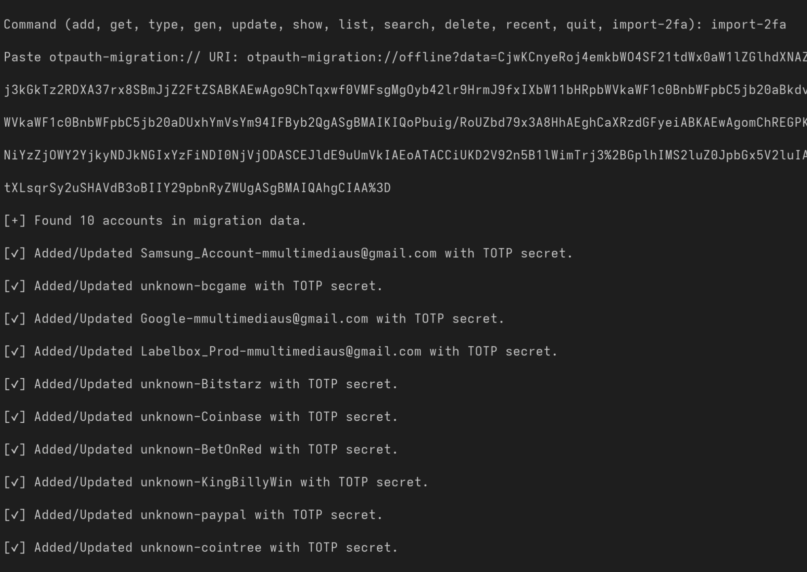

# 🔐 Passmgr (v3.0.0 Final — Fedora Wayland Edition)

Password & 2FA manager with vault encryption, Wayland clipboard, ydotool typing support, and Google Authenticator migration import.

---

## 🚀 Features
- Encrypted vault (PBKDF2 + Fernet)
- 2FA (TOTP) support
- Import `otpauth-migration://` URIs (Google Authenticator export)
- Map 2FA secrets between entries (`map-2fa`)
- Wayland clipboard copy / auto-paste via `wl-copy` + `ydotool`
- Backup/restore resilience
- Licence verification system

---

## 📸 Screenshots

### Vault Unlock & Verification



### Get&Add Username&Password 



### Get Login + 2FA Codes



### Map 2FA Between Accounts


### Import Google Authenticator Accounts



---

## 🛠 Installation

```bash
git clone https://github.com/YOUR-USER/passmgr.git
cd passmgr
chmod +x setup.sh
./setup.sh
```

---

## 📦 Usage

Run with:

```bash
sudo python passmgr.py
```

Available commands:
```
add, get, type, gen, update, show, list, search,
delete, recent, quit, import-2fa, map-2fa
```

---

## 🌐 Example

```bash
Command: import-2fa
Paste otpauth-migration:// URI: <pasted from Authenticator export>

---

## 🤖 GitHub Actions CI

Every push will auto-test the script loads with:

```bash
python passmgr.py --help
```
